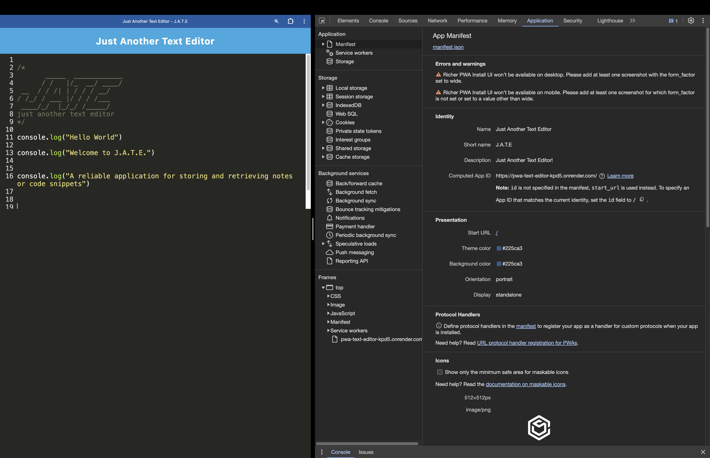
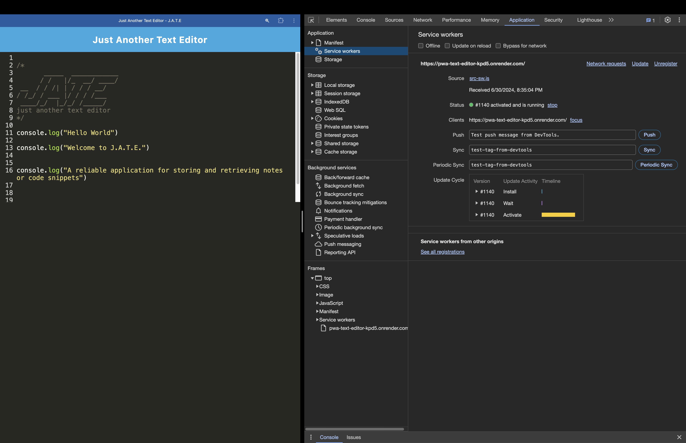
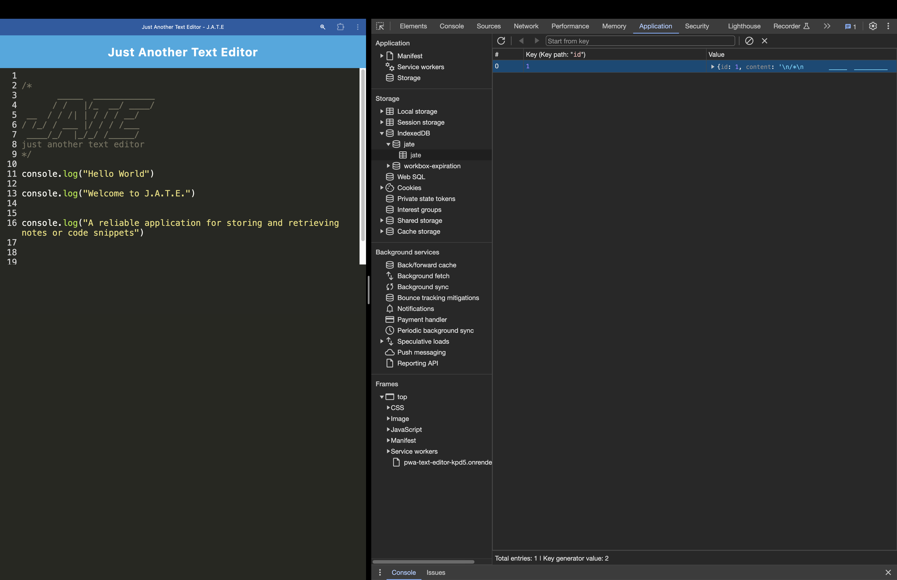

# PWA-Text-Editor

## Description

This project is a Progressive Web Application (PWA) text editor that allows users to create notes or code snippets with or without an internet connection. This application utilizes IndexedDB for data persistence, ensuring that content is saved even when offline. The application also features a service worker and manifest file for installation as a standalone application on desktop or mobile devices.

### User Story

```markdown
AS A developer
I WANT to create notes or code snippets with or without an internet connection
SO THAT I can reliably retrieve them for later use
```

### Acceptance Criteria

```markdown
GIVEN a text editor web application
WHEN I open my application in my editor
THEN I should see a client server folder structure
WHEN I run `npm run start` from the root directory
THEN I find that my application should start up the backend and serve the client
WHEN I run the text editor application from my terminal
THEN I find that my JavaScript files have been bundled using webpack
WHEN I run my webpack plugins
THEN I find that I have a generated HTML file, service worker, and a manifest file
WHEN I use next-gen JavaScript in my application
THEN I find that the text editor still functions in the browser without errors
WHEN I open the text editor
THEN I find that IndexedDB has immediately created a database storage
WHEN I enter content and subsequently click off of the DOM window
THEN I find that the content in the text editor has been saved with IndexedDB
WHEN I reopen the text editor after closing it
THEN I find that the content in the text editor has been retrieved from our IndexedDB
WHEN I click on the Install button
THEN I download my web application as an icon on my desktop
WHEN I load my web application
THEN I should have a registered service worker using workbox
WHEN I register a service worker
THEN I should have my static assets pre cached upon loading along with subsequent pages and static assets
WHEN I deploy to Render
THEN I should have proper build scripts for a webpack application
```

## Table of Contents

- [Installation](#installation)
- [Deployment](#deployment)
- [Usage](#usage)
- [Screenshots](#screenshots)
- [Features](#features)
- [Technologies Used](#technologies-used)
- [Contributing](#contributing)
- [License](#license)
- [Questions](#questions)

## Installation

To install this application:

1. Clone the Repository: `git clone https://github.com/PrestonNguyen2001/PWA-Text-Editor.git`
2. Navigate to the Root Directory: `cd PWA-Text-Editor`
3. Install Dependencies: `npm install`
4. Build the Client: `npm run build`
5. Start the Application: `npm run start:dev`

## Deployment

The application is deployed on Render. You can access the live application [here](https://pwa-text-editor-kpd5.onrender.com)

## Usage

- **Open the Application**: Open the application in your browser by going to `http://localhost:3000` or by clicking on the live application link above.
- **Create and Save Content**: Enter your notes or code snippets. The content is automatically saved when you click off the DOM window.
- **Offline Functionality**: The application works without an internet connection.
- **Install the Application**: Click on the Install button to download the web application on your desktop.

## Screenshots

The following animation demonstrates the application functionality:


The following image shows the application's `manifest.json` file:



The following image shows the application's registered service worker:



The following image shows the application's IndexedDB storage:




## Features

- **IndexedDB Storage**: Automatically creates a database storage upon opening the text editor.
- **Service Worker**: Caches static assets and subsequent pages.
- **Installable PWA**: Can be installed as a desktop application.
- **Offline Functionality**: Works without an internet connection.

## Technologies Used

- **IndexedDB**: For storing and retrieving data.
- **Webpack**: For bundling JavaScript files.
- **Babel**: For using modern JavaScript features.
- **Workbox**: For creating service workers and caching static assets.
- **idb**: A lightweight wrapper around the IndexedDB API.

## Contributing

Contributions are welcome! Please fork the repository and submit a pull request with your changes.

## License

This project is licensed under the MIT License. See the LICENSE file for more details.

## Questions

- If you have any questions, feel free to reach out via: <https://github.com/PrestonNguyen2001>
- For additional questions or support, contact me at <prestonnguyen2001@gmail.com>
